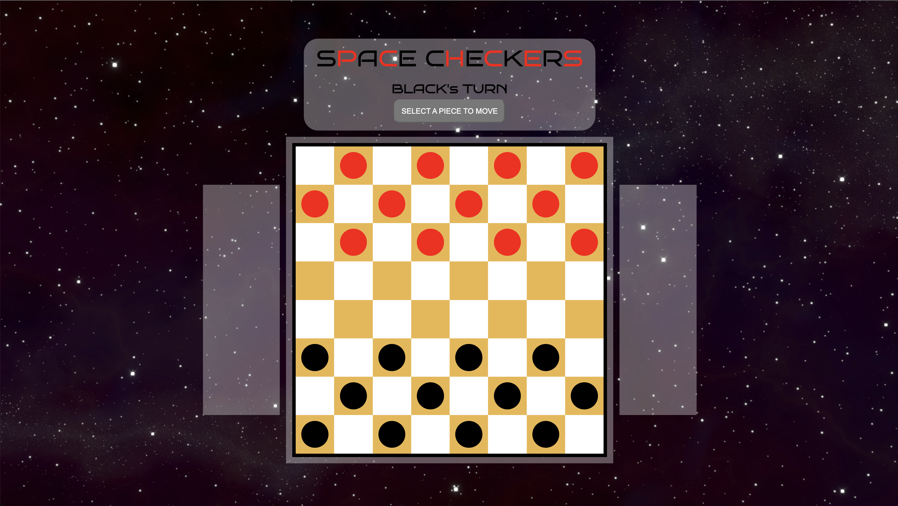

# Checkers

(Not Chess)

# Screenshots

# Technologies Used

- JavaScript
- HTML
- CSS

# Play the Game

[Click to Play Checkers!](https://clem-alleynejr.github.io/checkers/)

# Next Steps

- Improvements on styling
- Remove need for "Change Piece" Button
- Allow for chained jumps
